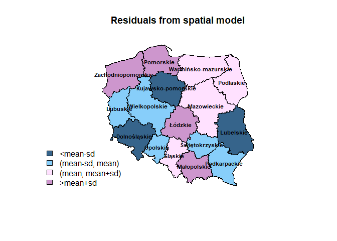
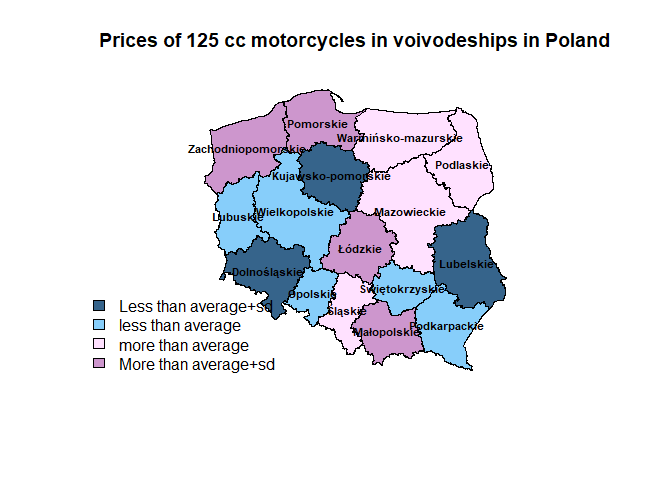

# Spatial analysis of 125cc motorcycles prices in Poland

As Otomoto.pl is one of the biggest polish sites to sell vehicles, it may precisely represent whole market. In this project I will analyse auctions of new and used motorcycles with 125cc engine.  

### Data Scrapping


```r
base_site = "https://www.otomoto.pl/motocykle-i-quady/chopper--krosowy--motorower--sportowy--turystyczny--typ-cruiser--typ-enduro--typ-naked/?search%5Bfilter_float_engine_capacity%3Afrom%5D=125&search%5Bfilter_float_engine_capacity%3Ato%5D=125&search%5Border%5D=created_at%3Adesc&search%5Bcountry%5D=&page=1"

#Scraper for single page
scrap <- function(site){
  link <- xml2::read_html(site)
  
  motorcycle_model <- link %>%
    html_nodes(xpath='//*[@id="body-container"]/div[2]/div[1]/div/div[1]/div[5]/article[@data-variation="a"]/div[2]/div[1]/h2/a') %>%
   html_text()

  price <- link %>%
    html_nodes(xpath='//*[@id="body-container"]/div[2]/div[1]/div/div[1]/div[5]/article[@data-variation="a"]/div[2]/div[2]/div/div/span/span[1]') %>%
    html_text()

  city_name <- link %>%
    html_nodes(xpath='//*[@id="body-container"]/div[2]/div[1]/div/div[1]/div[5]/article[@data-variation="a"]/div[2]/h4/span[2]') %>%
    html_text()

  voivodeship <- link %>%
    html_nodes(xpath='//*[@id="body-container"]/div[2]/div[1]/div/div[1]/div[5]/article[@data-variation="a"]/div[2]/h4/span[3]') %>%
    html_text()

  year_of_production <- link %>%
    html_nodes(xpath='//*[@id="body-container"]/div[2]/div[1]/div/div[1]/div[5]/article[@data-variation="a"]/div[2]/ul/li[1]/span') %>%
    html_text()

  mileage <- link %>%
    html_nodes(xpath='//*[@id="body-container"]/div[2]/div[1]/div/div[1]/div[5]/article[@data-variation="a"]/div[2]/ul/li[2]/span') %>%
    html_text()

  site_data <- cbind(price,city_name,voivodeship,year_of_production,mileage)
  return(site_data)
}

#Scraper for all pages
get_data <- function(site){
  link <- xml2::read_html(site)
  
  num_of_sites <- link %>%
    html_nodes(xpath='//*[@id="body-container"]/div[2]/div[2]/ul/li[6]/a/span') %>%
    html_text()
  
  data <- as.data.frame(scrap(site))
  
  for(i in 2:num_of_sites){
    print(paste("Scrapped", i-1, "pages of", num_of_sites))
    data <- rbind(data, scrap(paste(substr(site, 1, nchar(site)-1), i, sep = "")))
    Sys.sleep(1)
  }
  print("Finished")
  return(data)
}

#Data manipulation
data <- get_data(base_site)
data$price <- as.integer(gsub(" ","", data$price))
data$voivodeship <- substr(data$voivodeship,2,nchar(data$voivodeship)-1)
data$mileage <- gsub(" ","", data$mileage)
data$mileage <- as.integer(gsub("km","", data$mileage))
data$age <- 2020-as.integer(data$year_of_production)

write.csv(data, file="data_otomoto.csv")
```

Data was scrapped once in order to obtain stability and saved to csv file.

### Maps setup


<!-- -->

### Spatial weight matrix

Creating spatial weight matrix by setting voivodships coordinates as centroids of spatial polygons 


```r
voi.df<-as.data.frame(voi)


crds<-coordinates(voi)


cont.nb<-poly2nb(as(voi, "SpatialPolygons"))
cont.listw<-nb2listw(cont.nb, style="W")
```

### Data manipulation

Aggregation of data by voivodships. Mean of price, mileage and vehicle age are taken. Then data is sorted by fitting order to spatial weights matrix. 


```r
data_otomoto <- read_csv("data_otomoto.csv")
```

```
## Parsed with column specification:
## cols(
##   X1 = col_double(),
##   price = col_double(),
##   city_name = col_character(),
##   voivodeship = col_character(),
##   year_of_production = col_double(),
##   mileage = col_double(),
##   age = col_double()
## )
```

```r
order <- c("Opolskie","Świętokrzyskie","Kujawsko-pomorskie","Mazowieckie","Pomorskie","Śląskie", "Warmińsko-mazurskie","Zachodniopomorskie","Dolnośląskie","Wielkopolskie","Łódzkie","Podlaskie","Małopolskie","Lubuskie","Podkarpackie","Lubelskie")

data_agg <- aggregate(list(data_otomoto$price, data_otomoto$mileage, data_otomoto$age), by = list(data_otomoto$voivodeship), FUN = mean)
colnames(data_agg) = c("voi","mean_price", "mean_mileage","mean_age")

data_agg <- data_agg[match(order,data_agg$voi),]
```

### Models estimation

Various spatial models are estimated explaining mean vehicles price in voivodship by mean mileage and age. Estimated models include spatial lag of y, spatial lag of x and residuals spatial lag. Models without particular lags and Ordinary Least Squares method were also included.


```r
form <- mean_price~mean_mileage+mean_age

#OLS Model
OLS_1<-lm(form, data=data_agg)

# Manski model (full specification) 
GNS_1<- sacsarlm(form, data = data_agg, listw=cont.listw, type="sacmixed")

# SAC / SARAR model 
SAC_1<-sacsarlm(form, data = data_agg, listw=cont.listw)

SDEM_1 <- errorsarlm(form, data = data_agg, listw=cont.listw, etype="emixed")

# no spatial lags of X (SEM)
SEM_1 <- errorsarlm(form, data = data_agg, listw=cont.listw)

# SAR / SDM - spatial lag model
# with spatial lags of X (SDM)
SDM_1 <- lagsarlm(form, data = data_agg, listw=cont.listw, type="mixed") 

# no spatial lags of X (SAR)
SAR_1 <- lagsarlm(form, data = data_agg, listw=cont.listw) 

# from errorsarlm() library
SLX_1 <- lmSLX(form, data = data_agg, listw=cont.listw)
```

After applying various approaches for estimation, the task is to pick the best-fitted model. We will use Akaike Information Cryterion to choose between 8 estimated model.


```r
AIC(GNS_1, SDM_1, SDEM_1, SAC_1, SAR_1, SEM_1, SLX_1, OLS_1)
```

```
##        df      AIC
## GNS_1   8 293.3165
## SDM_1   7 291.7394
## SDEM_1  7 291.4060
## SAC_1   6 290.1091
## SAR_1   5 288.2204
## SEM_1   5 288.2309
## SLX_1   6 290.3968
## OLS_1   4 286.7127
```

```r
moran.test(OLS_1$residuals, cont.listw)
```

```
## 
## 	Moran I test under randomisation
## 
## data:  OLS_1$residuals  
## weights: cont.listw    
## 
## Moran I statistic standard deviate = -0.20179, p-value = 0.58
## alternative hypothesis: greater
## sample estimates:
## Moran I statistic       Expectation          Variance 
##       -0.09683759       -0.06666667        0.02235553
```

After appliance of AIC function to all estimated models, the best one turned out to be nonspatial OLS model. Randomness of residuals over space was tested by Moran test, which with p-value = 0.58 didn't rejected null hypothesis of no autocorrelation of residuals over space. Therefore no spatial dependence exists in that case and OLS is best model to interpret prices of 125 cc motorcycles 
Therefore we plot best places in Poland to buy cheaper than average 125cc motorcycles 


```r
res <- OLS_1$residuals
brks<-c(min(res)-1, mean(res)-sd(res), mean(res), mean(res)+sd(res), max(res)+1)
cols<-c("steelblue4","lightskyblue","thistle1","plum3")

plot(voi, col=cols[findInterval(res,brks)])
title(main="Residuals from spatial model")
legend("bottomleft", legend=c("<mean-sd", "(mean-sd, mean)", "(mean, mean+sd)", ">mean+sd"), leglabs(brks1), fill=cols, bty="n")

voi.df<-as.data.frame(voi)
voi.df$names <- order
text(coordinates(voi), label=voi.df$names, cex=0.7, font=2)
```

<!-- -->

```r
plot(voi, col=cols[findInterval(res,brks)])
title(main="Prices of 125 cc motorcycles in voivodeships in Poland")
legend("bottomleft", legend=c("Less than average+sd", "less than average", "more than average", "More than average+sd"), leglabs(brks1), fill=cols, bty="n")
voi.df<-as.data.frame(voi)
voi.df$names <- order
text(coordinates(voi), label=voi.df$names, cex=0.7, font=2)
```

<!-- -->

